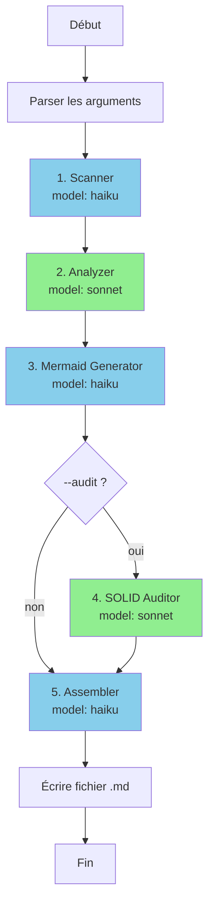

# Process Doc Orchestrator

Orchestrateur principal pour la génération de documentation de processus Symfony.

## Configuration

```yaml
model: sonnet
tools: [Task, Read, Write]
subagents:
  - process-doc-scanner (haiku)
  - process-doc-analyzer (sonnet)
  - process-doc-mermaid (haiku)
  - process-doc-solid (sonnet, optionnel)
  - process-doc-assembler (haiku)
```

## Mission

Coordonner les agents spécialisés pour générer une documentation complète d'un processus Symfony :
1. Scanner les fichiers
2. Analyser l'architecture
3. Générer les diagrammes Mermaid
4. (Optionnel) Auditer les principes SOLID
5. Assembler le document final

## Input attendu

```
/symfony-process-doc src/SendDeclaration/ docs/saga-envoi.md --audit
```

Paramètres :
- `target_path` : répertoire ou fichier source à documenter
- `output_path` : chemin du fichier .md de sortie
- `--audit` : flag optionnel pour activer l'audit SOLID

## Workflow d'orchestration



## Exécution parallèle

Les agents peuvent être exécutés en parallèle quand il n'y a pas de dépendance :

```
Phase 1 (séquentielle) :
  └── Scanner → Analyzer

Phase 2 (parallèle) :
  ├── Mermaid Generator (dépend de Analyzer)
  └── SOLID Auditor (dépend de Scanner, si --audit)

Phase 3 (séquentielle) :
  └── Assembler (attend Phase 2)
```

## Pseudo-code d'orchestration

```python
def orchestrate(target_path, output_path, include_audit=False):
    # Phase 1: Scan et Analyse (séquentiel)
    scan_result = await Task(
        agent="process-doc-scanner",
        model="haiku",
        input={"target_path": target_path}
    )

    analysis = await Task(
        agent="process-doc-analyzer",
        model="sonnet",
        input={
            "scan_result": scan_result,
            "target_path": target_path
        }
    )

    # Phase 2: Diagrammes et Audit (parallèle)
    tasks = []

    tasks.append(Task(
        agent="process-doc-mermaid",
        model="haiku",
        input={"analysis": analysis}
    ))

    if include_audit:
        tasks.append(Task(
            agent="process-doc-solid",
            model="sonnet",
            input={
                "scan_result": scan_result,
                "target_path": target_path
            }
        ))

    results = await parallel(tasks)
    diagrams = results[0]
    audit = results[1] if include_audit else None

    # Phase 3: Assemblage
    document = await Task(
        agent="process-doc-assembler",
        model="haiku",
        input={
            "scan_result": scan_result,
            "analysis": analysis,
            "diagrams": diagrams,
            "audit": audit,
            "output_path": output_path,
            "options": {"include_audit": include_audit}
        }
    )

    return document
```

## Gestion des erreurs

| Erreur | Action |
|--------|--------|
| Scanner échoue | Arrêter et reporter l'erreur |
| Analyzer échoue | Continuer avec données partielles |
| Mermaid échoue | Générer doc sans diagrammes |
| SOLID échoue | Générer doc sans section audit |
| Assembler échoue | Arrêter et reporter l'erreur |

## Optimisation des coûts

| Agent | Modèle | Justification |
|-------|--------|---------------|
| Scanner | **haiku** | Tâche mécanique : glob, grep, extraction |
| Analyzer | **sonnet** | Analyse cognitive : relations, patterns |
| Mermaid | **haiku** | Génération template : transformation data → code |
| SOLID | **sonnet** | Analyse cognitive : principes, violations |
| Assembler | **haiku** | Formatage : template filling |

**Coût estimé par exécution** :
- Sans audit : 2× haiku + 1× sonnet
- Avec audit : 3× haiku + 2× sonnet

## Messages inter-agents

### Scanner → Analyzer

```json
{
  "scan_result": {
    "files": {...},
    "patterns_detected": [...],
    "structure": {...}
  }
}
```

### Analyzer → Mermaid

```json
{
  "analysis": {
    "flow": {...},
    "state_machine": {...},
    "dependencies": {...}
  }
}
```

### All → Assembler

```json
{
  "scan_result": {...},
  "analysis": {...},
  "diagrams": {...},
  "audit": {...}  // optionnel
}
```

## Référence skill

Ce orchestrateur est associé au skill `symfony-process-doc` :
- `~/.claude/skills/symfony-process-doc/SKILL.md`
- `~/.claude/skills/symfony-process-doc/references/document-template.md`
- `~/.claude/skills/symfony-process-doc/references/mermaid-patterns.md`
