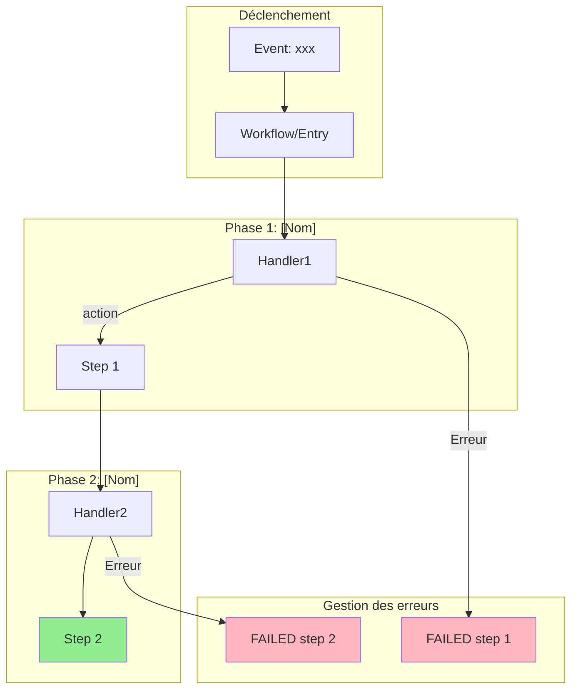
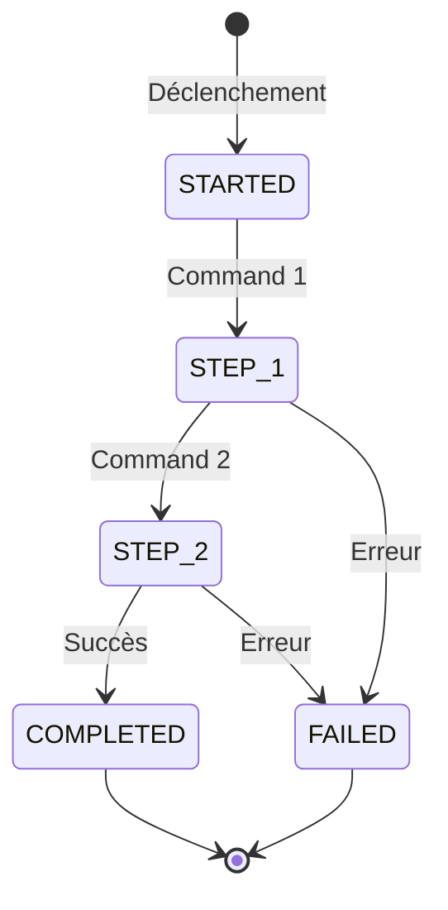
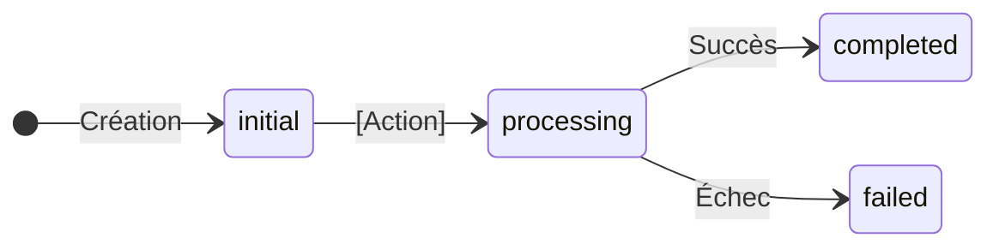
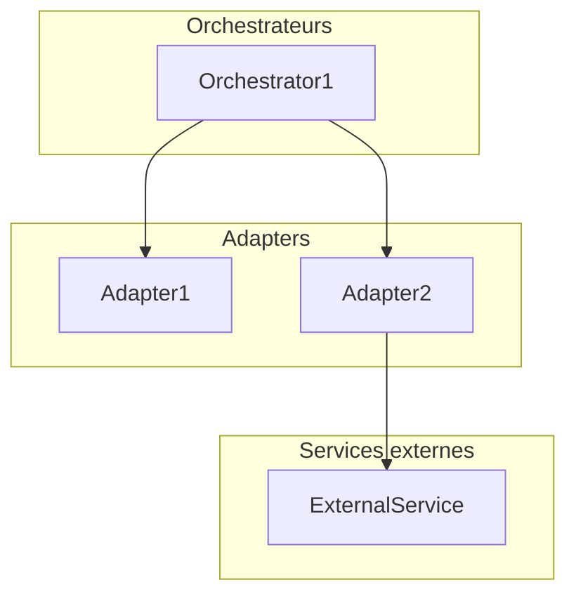

# Template de Documentation de Processus

Ce template définit la structure complète du document `.md` généré.

## Template complet

```markdown
# [Nom du Process] - Documentation

> **Date de documentation** : YYYY-MM-DD
> **Stack** : PHP X.X, Symfony X.X, [Messenger, Doctrine, etc.]
> **Architecture** : [Hexagonale, CQRS, Event-driven, Saga Pattern, etc.]
> **Chemin source** : `src/[Module]/`

## 1. Vue d'ensemble

[Description du processus : objectif, contexte métier, ce qu'il remplace ou améliore]

### 1.1 Diagramme du flux



### 1.2 Flux simplifié



## 2. Composants

### 2.1 Commands & Handlers

| Command | Handler | Responsabilité |
|---------|---------|----------------|
| `[CommandName]` | `[HandlerName]` | [Description courte] |

**Fichiers** :
- `src/[Module]/Application/Command/*.php`
- `src/[Module]/Application/Handler/*.php`

### 2.2 Events déclencheurs

| Event | Source | Description |
|-------|--------|-------------|
| `[event.name]` | [Source] | [Description] |

### 2.3 Services & Infrastructure

| Service | Type | Rôle |
|---------|------|------|
| `[ServiceName]` | [Repository/Client/Helper] | [Rôle] |

### 2.4 Activities (si Workflow)

| Activity | Rôle |
|----------|------|
| `[ActivityName]` | [Description] |

## 3. Machine à états

### 3.1 États principaux

```php
enum [EntityStatus]: string
{
    case STATE_1 = 'state_1';
    case STATE_2 = 'state_2';
    // ...
}
```

### 3.2 Étapes du processus (si Saga)

```php
enum [ProcessStep]: string
{
    case STEP_1 = 'step_1';
    case STEP_2 = 'step_2';
    // ...
}
```

### 3.3 Transitions



## 4. Architecture (Ports & Adapters)

### 4.1 Structure des fichiers

```
src/[Module]/
├── Application/
│   ├── Command/
│   └── Handler/
├── Domain/
│   ├── Entity/
│   ├── Port/
│   │   └── [Interface]/
│   └── ValueObject/
└── Infrastructure/
    ├── Repository/
    └── Adapter/
        └── [Provider]/
```

### 4.2 Interfaces (Ports)

#### [InterfaceName]

```php
interface [InterfaceName]
{
    /**
     * [Description méthode]
     */
    public function method(Type $param): ReturnType;

    public static function getKey(): string;
}
```

### 4.3 Implémentations (Adapters)

| Adapter | Interface | Responsabilité |
|---------|-----------|----------------|
| `[AdapterName]` | `[InterfaceName]` | [Description] |

### 4.4 Diagramme des dépendances



## 5. Entités et modèles

### 5.1 [EntityName]

```php
#[ORM\Entity]
#[ORM\Table(name: '[table_name]')]
class [EntityName]
{
    // Propriétés
    private string $id;
    private [Type] $property;
    // ...
}
```

**Propriétés clés** :

| Propriété | Type | Description |
|-----------|------|-------------|
| `id` | string | UUID v7 |
| `[property]` | [Type] | [Description] |

## 6. Repository et persistance

### 6.1 [RepositoryName]Interface

```php
interface [RepositoryName]Interface
{
    public function save([Entity] $entity): void;
    public function findById(string $id): ?[Entity];
    // ...
}
```

### 6.2 Séparation Core/Query (si ISP)

**Core** (handlers) :
```php
interface [Entity]RepositoryInterface
{
    public function save([Entity] $entity): void;
    public function findById(string $id): ?[Entity];
}
```

**Query** (monitoring) :
```php
interface [Entity]QueryRepositoryInterface extends [Entity]RepositoryInterface
{
    public function findFailed(): array;
    public function findRecent(\DateTimeImmutable $since): array;
}
```

## 7. Points d'attention

### 7.1 Points forts ✅

| Aspect | État | Description |
|--------|------|-------------|
| **[Aspect]** | ✅ Complet | [Description] |
| **[Aspect]** | ✅ Partiel | [Description avec nuance] |

### 7.2 Améliorations suggérées

| Problème | Impact | Solution suggérée |
|----------|--------|-------------------|
| **[Problème]** | [Impact] | [Solution] |

### 7.3 Dettes techniques

1. **[Dette]** : [Description et impact]
2. **[Dette]** : [Description et impact]

## 8. Audit SOLID

> Section générée si `--audit` est activé

**Score** : XX/100 ([Évaluation])

### Résumé

| Principe | Violations | Sévérité max |
|----------|------------|--------------|
| SRP | X | HIGH/MEDIUM/LOW |
| OCP | X | ... |
| LSP | X | ... |
| ISP | X | ... |
| DIP | X | ... |

### Violations critiques

#### [S] Single Responsibility

**`[Namespace\ClassName]`** - HIGH
- **Problème** : [Description]
- **Recommandation** : [Action]

### Actions prioritaires

1. [ ] [Action] (impact: -X points)
2. [ ] [Action]

## 9. Tests

### 9.1 Tests unitaires

| Fichier | Couverture |
|---------|------------|
| `[TestName]Test.php` | [Composant testé] |

### 9.2 Tests d'intégration

| Fichier | Couverture |
|---------|------------|
| `[TestName]Test.php` | [Scénario testé] |

### 9.3 Commandes de test

```bash
# Test manuel
php bin/console app:test:[command] --param=value
```

## 10. Annexes

### 10.1 Schéma de la base de données

```sql
CREATE TABLE [table_name] (
    id VARCHAR(36) PRIMARY KEY,
    [column] [TYPE] [CONSTRAINTS],
    -- ...

    INDEX idx_[name] ([columns])
);
```

### 10.2 Configuration Symfony

```yaml
# config/services.yaml (extrait)
services:
    [ServiceInterface]:
        tags: ['container.service_locator_context']
```

### 10.3 Ajouter un nouveau [Provider/Adapter]

1. **Créer les adapters** dans `Infrastructure/[Provider]/`
2. **Implémenter les interfaces** avec `#[AsTaggedItem('key')]`
3. **Utiliser** avec le paramètre approprié
```

## Sections optionnelles

Selon le type de processus, certaines sections peuvent être omises :

| Section | Saga | Workflow | Service | Handler |
|---------|------|----------|---------|---------|
| 1. Vue d'ensemble | ✅ | ✅ | ✅ | ✅ |
| 2. Composants | ✅ | ✅ | ✅ | ✅ |
| 3. Machine à états | ✅ | ✅ | ❌ | ❌ |
| 4. Architecture | ✅ | ✅ | ✅ | ⚠️ |
| 5. Entités | ✅ | ✅ | ⚠️ | ⚠️ |
| 6. Repository | ✅ | ✅ | ⚠️ | ⚠️ |
| 7. Points d'attention | ✅ | ✅ | ✅ | ✅ |
| 8. Audit SOLID | ⚠️ | ⚠️ | ⚠️ | ⚠️ |
| 9. Tests | ✅ | ✅ | ✅ | ✅ |
| 10. Annexes | ✅ | ✅ | ⚠️ | ⚠️ |

✅ = Toujours inclure | ⚠️ = Si applicable | ❌ = Ne pas inclure
