# Patterns Mermaid pour Symfony

Exemples de diagrammes Mermaid par type de processus Symfony.

## Table des matières

1. [Saga Pattern](#saga-pattern)
2. [CQRS / Command Handler](#cqrs--command-handler)
3. [Event-Driven / Messenger](#event-driven--messenger)
4. [Architecture Hexagonale](#architecture-hexagonale)
5. [Workflow Symfony](#workflow-symfony)
6. [API / Controller](#api--controller)

---

## Saga Pattern

### Flowchart - Flux complet

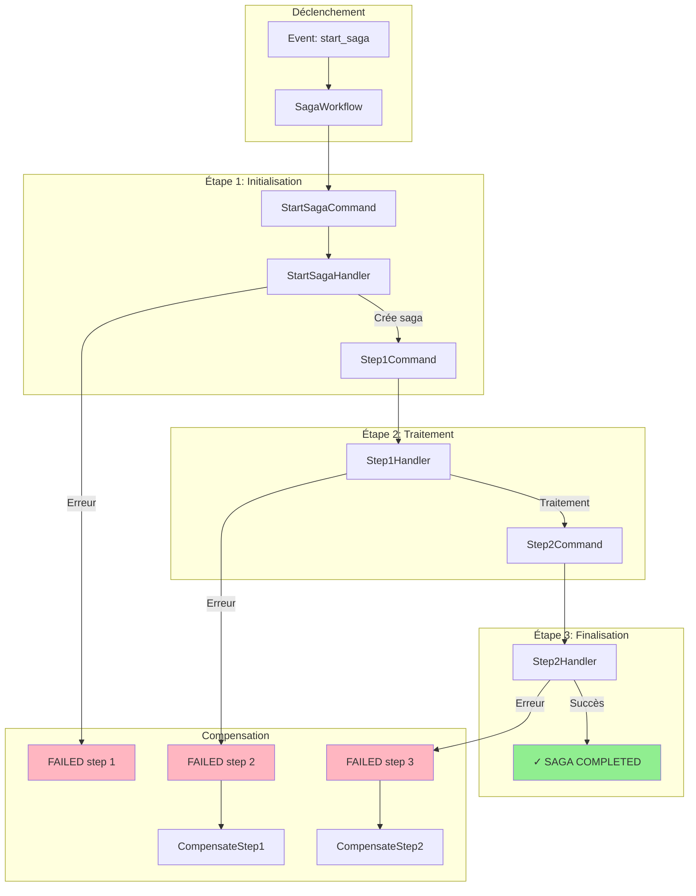

### State - Machine à états

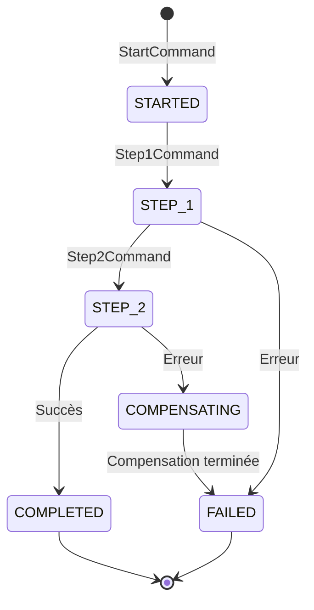

### Sequence - Orchestration

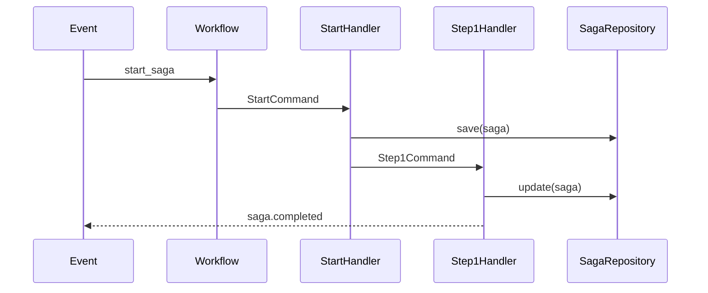

---

## CQRS / Command Handler

### Flowchart - Command/Query séparation

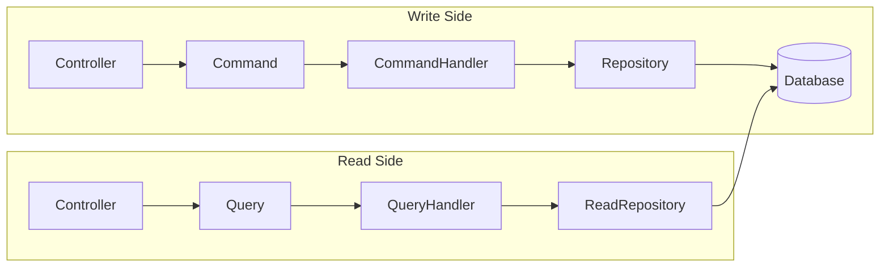

### Sequence - Command flow

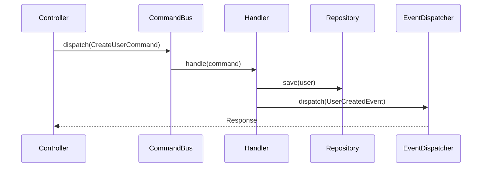

### Class - Structure CQRS

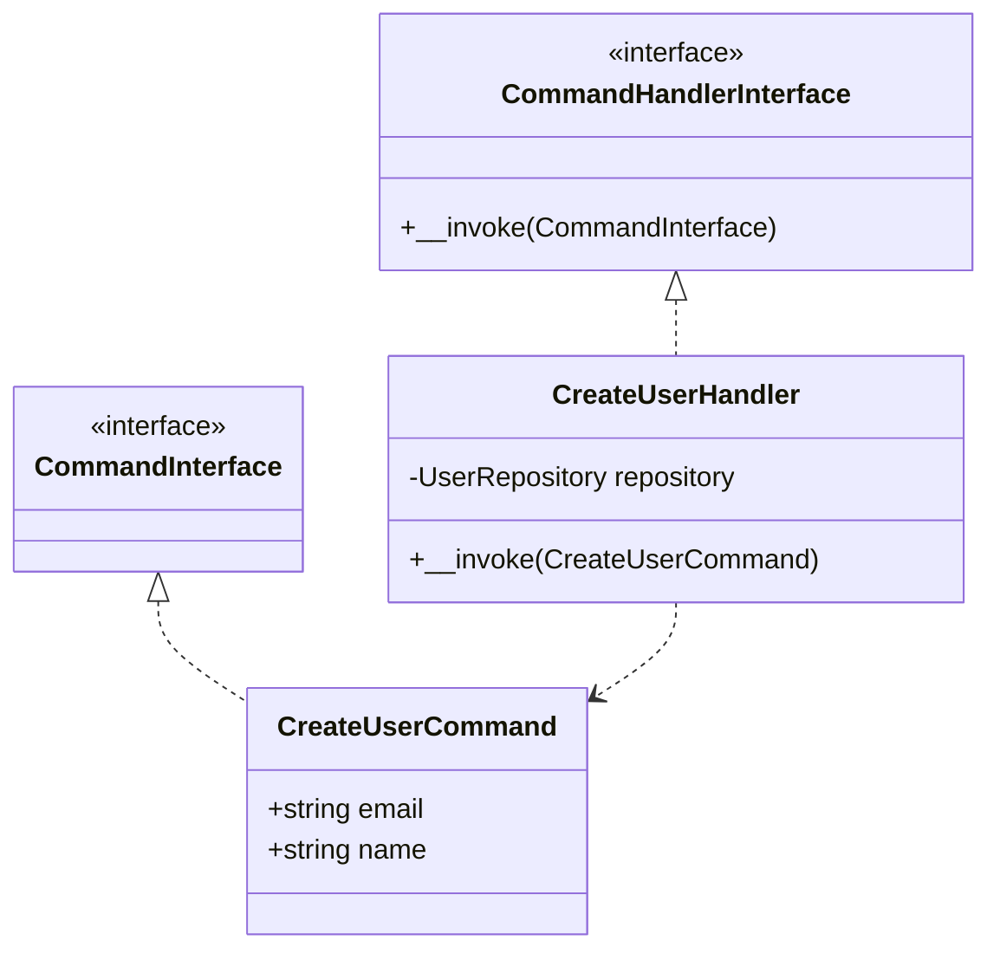

---

## Event-Driven / Messenger

### Flowchart - Event propagation

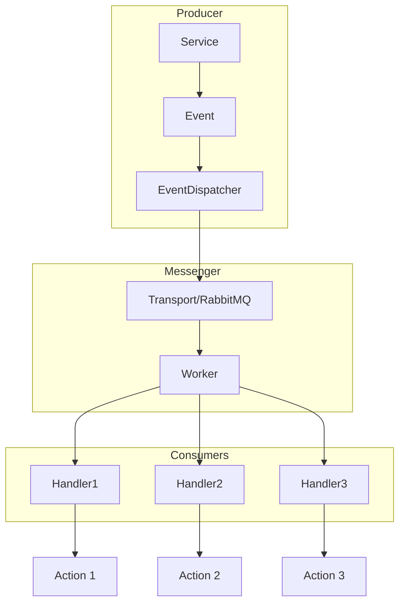

### Sequence - Async processing

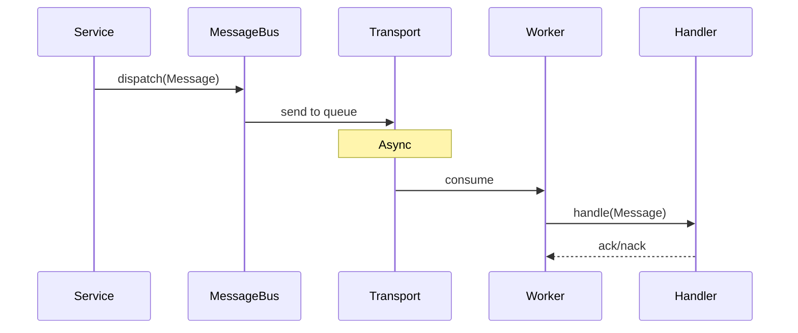

---

## Architecture Hexagonale

### Flowchart - Ports & Adapters

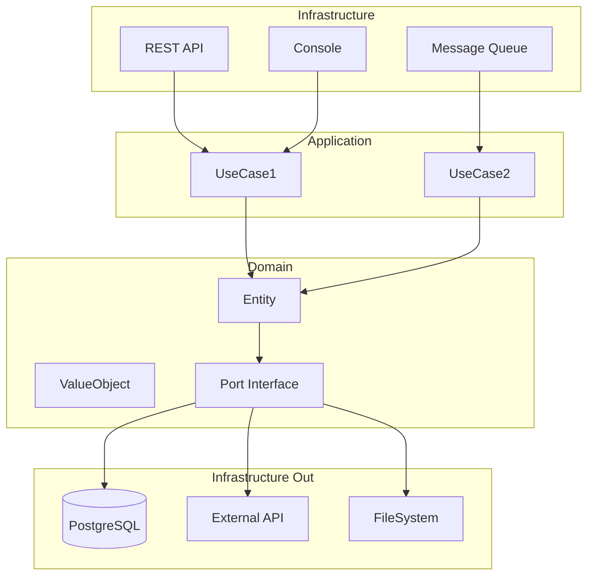

### Class - Port/Adapter

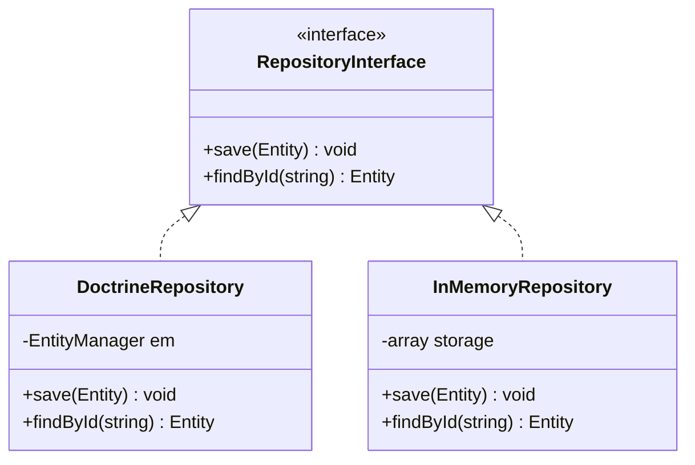

### Flowchart - ServiceLocator pattern

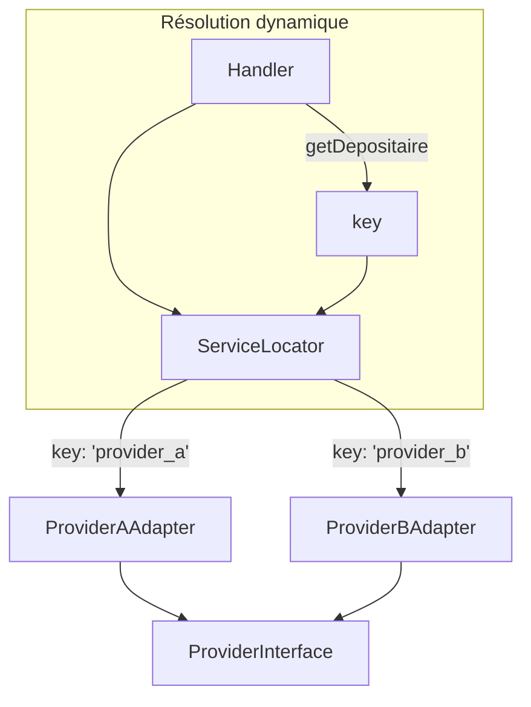

---

## Workflow Symfony

### State - Workflow places

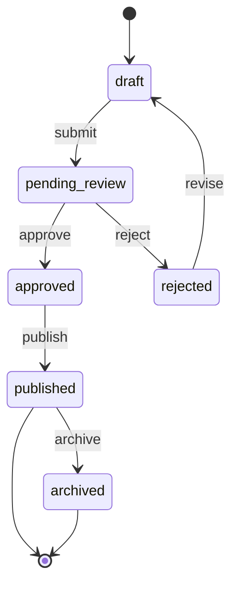

### Flowchart - Workflow avec guards

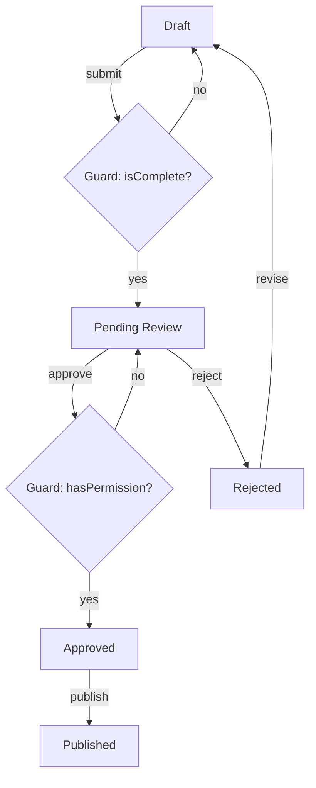

---

## API / Controller

### Sequence - REST endpoint

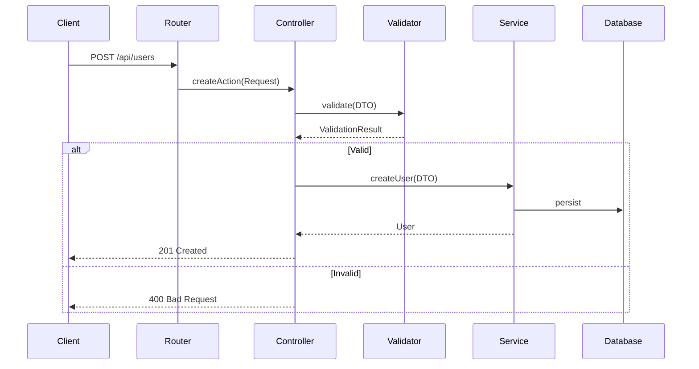

### Flowchart - Error handling

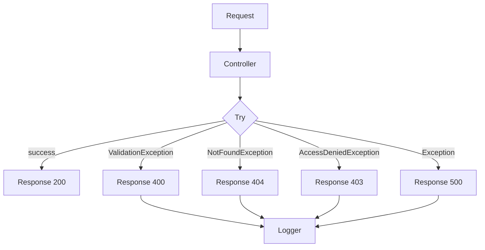

---

## Styles et couleurs

### Palette recommandée

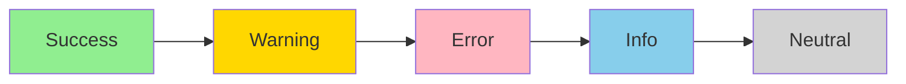

### Subgraphs pour phases

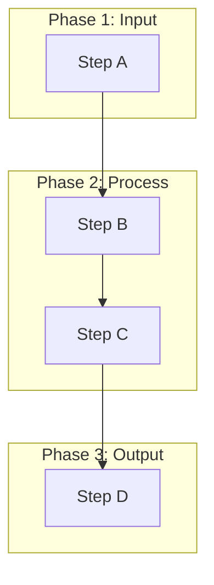

## Conseils

1. **Nommer les nœuds** : Utiliser des noms courts mais explicites
2. **Grouper logiquement** : Utiliser `subgraph` pour les phases/couches
3. **Couleurs cohérentes** : Vert=succès, Rouge=erreur, Jaune=warning
4. **Limiter la complexité** : Max 15-20 nœuds par diagramme
5. **Direction** : `TD` pour flux vertical, `LR` pour horizontal
